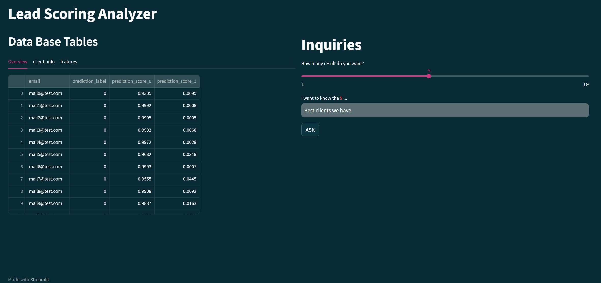
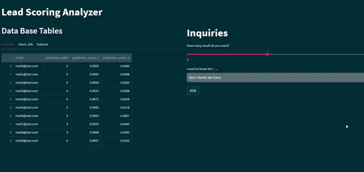

## Natural Language to SQL Query Execution Application

Project Logo

### Overview

The Natural Language to SQL Query Execution Application is a cutting-edge Python project that seamlessly blends the power of Natural Language Processing (NLP) with SQL database queries. This interactive application allows users, regardless of their SQL knowledge, to effortlessly execute SQL queries using intuitive and human-readable natural language inputs.



### Technology Stack

The project leverages the following technologies:

- Python: The primary programming language used for developing the application.
- Streamlit: A user-friendly web framework for creating interactive data apps, serving as the user interface.
- OpenAI GPT-3.5 Turbo: The advanced NLP language model used for transforming natural language prompts into SQL queries.
- SQLAlchemy: A powerful SQL toolkit and Object-Relational Mapper (ORM) utilized for database connections.

### Getting Started

To launch the application, follow these steps:

1. Clone the repository to your local machine.
2. Install the required dependencies using `pip install -r requirements.txt`.
3. Open your terminal and navigate to the project's root directory.
4. Run the following command:

```bash
streamlit run yourpath/SQLNaturaLanguage/src/streamlit_app.py

## Features

- Intuitive Chat-Like Interface: Users can interact with the application using a user-friendly and engaging chat-like interface, making SQL queries easy and approachable.
- Natural Language Processing: The NLP-powered language model understands natural language prompts and generates SQL queries accordingly.
- Database Interaction: The application connects seamlessly to the specified SQL database, executing queries and returning results in real-time.
- Error Handling: Comprehensive error handling ensures a smooth user experience even in the presence of invalid inputs.

## Usage

1. Enter your SQL database credentials and API key in the appropriate configuration files.
2. Access the application using the provided terminal command.
3. Input your SQL-related questions or queries in simple English language.
4. Observe the application transforming your natural language inputs into valid SQL queries and displaying query results.

## Contributions

We welcome contributions to enhance the application's capabilities and usability. To contribute, please follow the guidelines in the `CONTRIBUTING.md` file.

## License

This project is licensed under the [MIT License](link_to_license).

Let's make database interactions a breeze with the power of natural language and SQL integration! Feel free to share your feedback and ideas to improve the application further. Happy querying! 😎🚀